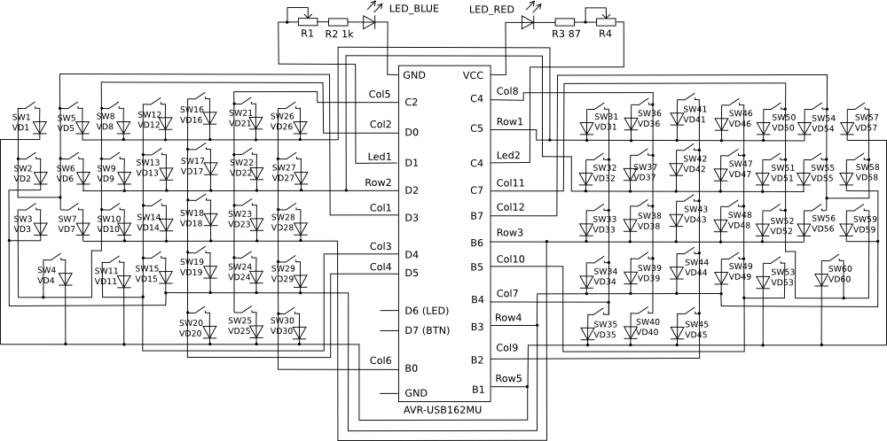
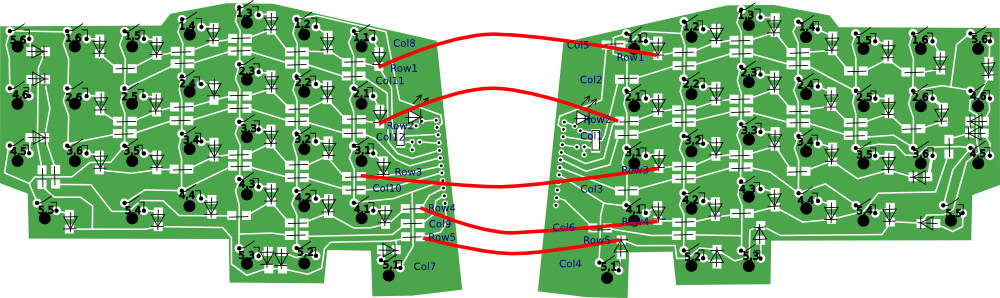

# CatBoard

Компактная клавиатура для машинописи, может использоваться поверх ноутбучной клавиатуры.

Основые отличия от стандартных клавиатур:

- эргономическое симметричное расположение клавиш;
- клавиши управления курсором на основном блоке клавиатуры с зажатой `Fn` (стрелки = `Fn+ijkl`, `home`/`end`/`pgup`/`pgdn` = `Fn+uop;`, `backspace`/`del`/`ins`/`enter` = `Fn+nm,h`);
- функциональные клавиши на цифровом ряду клавиатуры с зажатой `Fn`;
- другое расположение `Ctrl` и `Alt`, более удобное для работы, чем-то похоже на расположение клавиши `Command` в Apple клавиатурах;
- дополнительный `Shift` на большом пальце левой руки, при желании можно сделать на этом месте пробел;
- аппаратная нестандартная английская раскладка вместе со стандартной русской раскладкой, отдельные клавиши для включения раскладок, цветные светодиоды, показывающие текущую раскладку;
- клавиатурные сочетания с `Ctrl` и `Alt` на стандартной раскладке, что не получится сделать в софтверной раскладке;
- возможность перепрограммировать клавиатуру без подключения дополнительного оборудования;
- автоповтор нажатой клавиши по двойному нажатию на клавишу с её удержанием, скорость автоповтора зависит от скорости двойного нажатия клавиши.

## Корпус клавиатуры

Корпус изготавливается из оргстекла толщиной 1,5 мм, и пластиковых листов толщиной 3 мм. Последние можно заменить двойным изготовлением из слоёв 1,5 мм.

Исходные файлы для изготовления корпуса клавиатуры находятся в директории [/fablab/](fablab/), SVG файл (векторный редактор Inkscape), и DXF с единицей измерения в миллиметрах (нужно указать при импорте в Corel Draw).

## Контроллер клавиатуры

В качестве контроллера клавиатуры используется макетная плата [AVR-USB162MU](hardware/), с установленным микроконтроллером AT90USB162MU, в который прошит загрузчик DFU. Инструкции по работе с этим загрузчиком: <http://ibnteo.klava.org/avr/at90usb162>

Возможно использование [Teensy](http://www.pjrc.com/store/teensy.html) с небольшими изменениями в коде проекта.

## Схема подключения кнопок

В каждую кнопку Cherry MX можно устанавливить небольшой по размеру диод (КД522Б подошёл, [катод - два узких чёрных кольца, анод - широкое чёрное кольцо](http://radiosxema.comli.com/index.php/spravochnik/3-diod/6-diod-color)), схема установки диода нарисована на нижней части корпуса кнопки.

## Печатная плата

Односторонняя печатная плата с нулевыми SMD резисторами в качестве перемычек и SMD диодами.

## Прошивка

Прошивка основана на простом коде, найденном на форуме [geekhack.org](http://geekhack.org/index.php?topic=15542.0)

Исходные файлы располагаются в [firmware](firmware/).

## License

GPL2