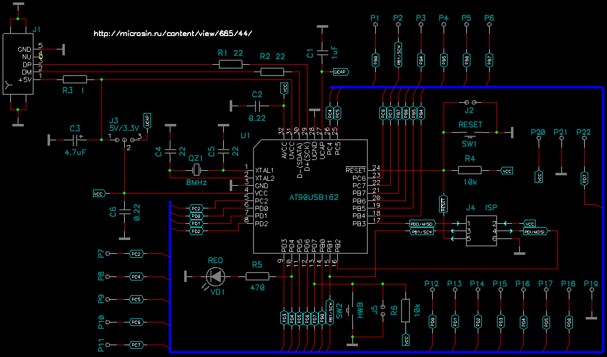
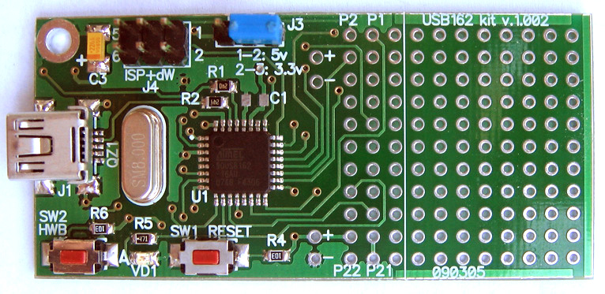
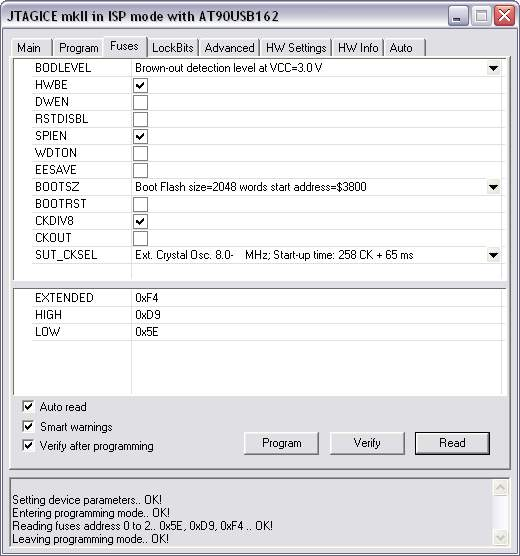
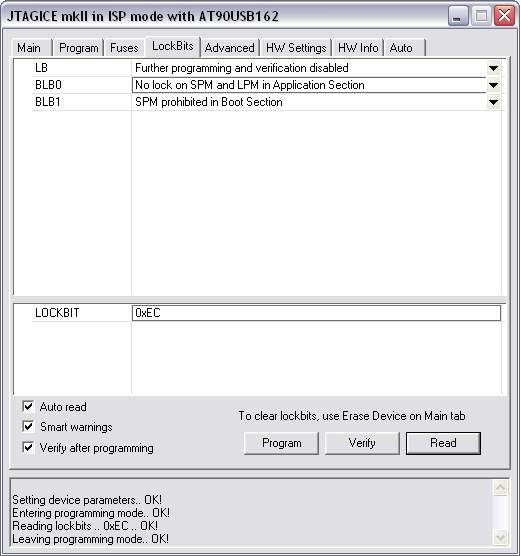
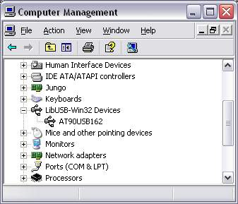
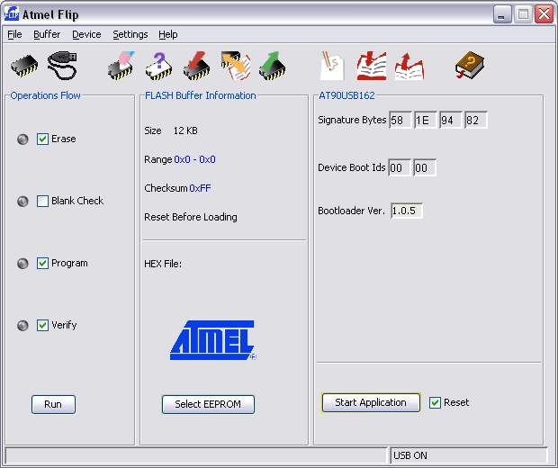

Макетная плата AVR-USB162	 

Написал microsin (http://microsin.ru/content/view/685/44/)
25.02.2009

Эта отладочная плата позволяет разрабатывать маленькие устройства **USB**. Чип **AT90USB162**, который установлен на плате, имеет встроенный аппаратный интерфейс, позволяющий изготавливать **full-speed USB 2.0** устройства, соответствующие современным требованиям. 

С помощью макетной платы **AVR-USB162*8 и библиотеки **LUFA** Вы легко можете разработать собственные устройства **HID** (клавиатуры, джойстики, мыши, устройства ввода/вывода и т. д.) или сделать последовательный порт на классе **CDC** (виртуальный COM-порт), причем разрабатывать драйвер для устройств HID и CDC не нужно - они работают на всех современных компьютерных платформах. Программное обеспечение для разработки также присутствует на всех современных операционных системах - включая Linux, Windows, и Macintosh (Mac OS).

		
На макетной плате AVR-USB162 установлены:

- **miniUSB** коннектор J1, через который питается плата.
- кнопка SW2 HWB, управляющая работой **bootloader**-а, и кнопка SW1 RESET.
- коннектор **ISP/debugWIRE J4**, через который можно запрограммировать плату с помощью стандартного программатора (avrdude, JTAGICE-mkII, PonyPROG и проч.), а также отлаживать программу через аппаратный отладчик, поддерживающий шину debugWIRE (например, JTAGICE-mkII). Программирование и отладка работают в широко известных IDE **AVRStudio** и **IAR Embedded Workbench**.
- перемычка J3, управляющая напряжением питания ядра микроконтроллера (иногда это может понадобиться).
- индикационный светодиод VD1.
- контактные площадки P1..P22, на которые разведены порты микроконтроллера и питание.
- макетное поле с шагом 2.54 мм (100 mil), которое можно при необходимости отпилить, уменьшив тем самым размер USB-устройства.

Размеры платы с макетным полем **64.8 x 30.7 мм**, без макетного поля 45.4 x 30.7 мм (для уменьшения размеров макетное поле можно отрезать). Толщина платы вместе с монтажом 11.5 мм (определяется самым высоким элементом на плате - ISP коннектором, он выступает над поверхностью TOP платы на 9 мм). USB-коннектор выступает за край платы на 2 мм.

В микроконтроллер прошито заводское программное обеспечение (**bootloader**, называемое также **DFU** - Device Firmware Uploader или Device Firmware Upgrade), позволяющее загрузить программу пользователя в память микроконтроллера через интерфейс USB и запустить её на выполнение. Это позволяет писать и отлаживать программы, не имея вообще никакого отладчика и программатора. Конечно, не те удобства, что предоставляет аппаратный отладчик **JTAGICE-mkII**, но зато дешево и сердито, затраты для быстрого старта минимальные. Программа и технология, предоставляющая такие возможности, называется **Flip** (FLexible In-system Programmer), программа бесплатна и доступна для скачивания на сайте **atmel.com**. Подробная документация, как все это делается, также доступна, правда на английском языке.

Прошивку-bootloader, записанную на фабрике Atmel (она обеспечивает работу Flip), нельзя считать **ISP**-программатором, поскольку она защищена lock-битами. Для того, чтобы можно было воспользоваться ISP-программатором или **debugWIRE**-отладчиком, чип придется стереть, что полностью уничтожит Flip-bootloader. Но особо печалиться по этому поводу не стОит, так как на сайте atmel.com доступен для свободного скачивания бинарник bootloader-a (bl_usb_162v105.zip [7]), и его всегда можно восстановить. Как я понял, использование Flip исключает применение для отладки обычного ISP-программатора и отладчика debugWIRE, и наоборот.

Установка программы, интерфейс Flip и работа с ним под Windows до предела упрощены - скачайте по ссылке [6] и установите. При подключении макетки AVR-USB162 по USB система запросит драйвера, подсуньте ей путь до c:\Program Files\Atmel\Flip 3.3.2\usb\ (это драйвер для bootloadera и Flip), после этого в системе появится устройство AT90USB162:

Запускаем программу Flip, выбираем в меню Device -> Select... -> AT90USB162, жмем вторую кнопочку со шнурком на картинке (Select a Communication Medium), выбираем USB, в появившемся маленьком окошке жмем Open. Вуаля! Появился нехитрый интерфейс программатора Flip:

Как видно на скриншоте, доступно для использованием пользователем только 12 килобайт памяти (4 килобайта съел Flip-bootloader).

[**Если bootloader не работает, программа Flip не видит чип AT90USB162**]

При исправной и правильной схеме может быть два варианта - у Вас стерт bootloader, либо записана пользовательская программа, которая получает управления вместо bootloader.

Если стерт bootloader - его надо восстановить с помощью ISP-программатора. Скачайте бинарник bootloader (bl_usb_162v105.zip [7]) и прошейте в чип AT90USB162.

Если запускается пользовательская программа, то bootloader можно запустить стандартной процедурой, описанной в документации:

- подключаем плату через USB
- нажимаем кнопку SW1 RESET
- удерживая кнопку SW1 RESET, нажимаем кнопку SW2 HWB
- удерживая кнопку SW2 HWB, отпускаем кнопку SW1 RESET
- отпускаем SW2 HWB

После этой процедуры у нас в системе должно появиться устройство LibUSB-Win32 Devices\AT90USB162 (см. в Диспетчере Устройств), и теперь снова будет работать программирование через USB с помощью программы DFU Flip. Если устройство LibUSB-Win32 Devices\AT90USB162 в Диспетчере Устройств не появилось, значит надо перепрошить bootloader (Вы его каким-то образом стерли). 

[**Как заказать**]

Если хотите приобрести макетную плату AVR-USB162, отправьте мне email (адрес см. на страничке [Контакты](http://microsin.ru/content/view/383/45/)), или оставьте комментарий ниже, указав контакты для связи с Вами (email, ICQ или телефон). Если Вы находитесь не в Москве, возможна [пересылка наложенным платежом](http://microsin.ru/content/view/1125/43/). **Внимание**: в таблице указана цена **без учета стоимости пересылки** (**180** руб. - это мои расходы на отправку бандероли, плюс еще около **60** рублей Вы заплатите на почте за почтовый перевод. Таким образом, например, готовая плата Вам обойдется 500+180+60=740 рублей). Возможна предоплата, тогда 60 рублей съэкономите.

Стоимость готовой макетной платы AVR-USB162               
(ничего паять не надо, плата полностью готовая
и рабочая)	**500 руб.**
Стоимость пустой печатной платы (только пустая, 
голая печатная плата, и больше ничего)  **100 руб.**

[**Аналоги**]

**AVRopendous**
**Teensy** USB Development Board
**AVR-USB-162** от Olimex
**Benito**
**DorkBoard**
**Bumble-B**

[**Проблемы и способы их решения**]

См. FAQ по ссылке [8].

[**Ссылки**]

1. [Общее описание библиотеки LUFA](http://microsin.ru/content/view/1110/44/) и [документация по библиотеке LUFA на русском языке](http://microsin.ru/Download.cnt/doc/LUFA/).
2. [Как из макетки AVR-USB162 сделать ISP программатор, совместимый с avrdude](http://microsin.ru/content/view/737/44/).
3. Примеры с сайта Olimex - для AVRStudio+WinAVR (gcc version 3.4.6).
- [мигание светодиодом](http://microsin.ru/Download.cnt/avr/usb162/avr-usb-162_Led.zip)
- [опрос кнопки](http://microsin.ru/Download.cnt/avr/usb162/avr-usb-162_Button.zip)
- [генератор частоты](http://microsin.ru/Download.cnt/avr/usb162/avr-usb_Frequency.zip)
- [демонстрационный код USB-мыши](http://microsin.ru/Download.cnt/avr/usb162/AVR-USB-162-MOUSE.zip)
- [демонстрационный код виртуального COM-порта](http://microsin.ru/Download.cnt/avr/usb162/AVR-USB-162-CDC.zip).
4. AVR-USB162: [где найти рабочие примеры кода firmware и ПО хоста](http://microsin.ru/content/view/793/44/)
5. [USB DFU Bootloader Datasheet](http://www.atmel.com/dyn/resources/prod_documents/doc7618.pdf) - описание bootloader (технология Flip) при работе через USB.
6. [FLIP](http://www.atmel.com/tools/flip.aspx) - программа Atmel, с помощью которой Вы можете прошить плату через USB без программатора (используется USB DFU Bootloader, встроенный в микросхему AT90USB162). По этой же ссылке доступно для закачки firmware бутлоадеров DFU Flip (см. также [7]). Старая версия Flip 3.3.2 здесь. 
7. [Прошивка bootloader](http://www.atmel.com/dyn/resources/prod_documents/bl_usb_162v105.zip).
8. [FAQ по макетной плате AVR-USB162 (чип AT90USB162)](http://microsin.ru/content/view/899/44/).

Последнее обновление ( 12.12.2012 )
